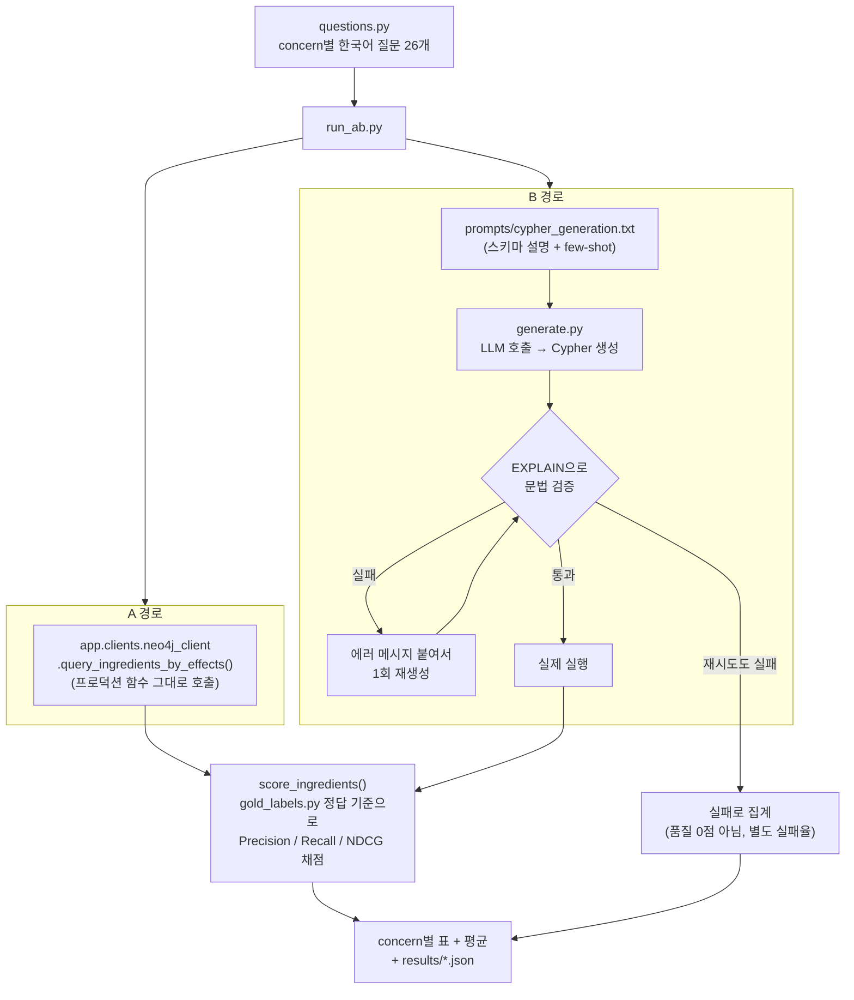

# llm_query_eval — LLM이 쿼리를 직접 짜면 추천 품질이 좋아질까?

## 이게 뭘 확인하려는 실험인가

지금 추천 서비스는 사용자가 "여드름 때문에 고민이에요"라고 말하면,

1. LLM이 이 문장에서 `concern`(고민 코드)만 뽑아내고
2. 미리 정해둔 딕셔너리(`CONCERN_EFFECT_MAP`)로 `concern → effect`를 변환하고
3. 미리 짜둔 고정 Cypher 쿼리에 그 `effect`를 끼워 넣어 실행합니다.

즉 **LLM은 "빈칸 채우기"만 하고, 실제 그래프 탐색 경로는 엔지니어가 미리 정해둔 것**입니다.

이 실험은 반대로 "LLM에게 그래프 스키마만 던져주고, 쿼리 자체를 즉석에서 직접 짜게 하면
(빈칸 채우기가 아니라 쿼리 자체를 생성하게 하면) 추천 품질이 더 좋아질까, 아니면
오히려 나빠질까?"를 미리 재보는 조사입니다. 실제로 프로덕션 구조를 바꾸는 건 아니고,
"바꿀 승산이 있는지"를 먼저 확인하는 단계입니다.

## 비교 대상 (A / B / D)

|  | 고정 쿼리 (엔지니어가 미리 작성) | LLM이 즉석에서 생성 |
|---|---|---|
| **그래프DB(Neo4j)** | **A** — 지금 프로덕션이 실제로 쓰는 것 | **B** — 이번에 새로 테스트 |
| **RDB(Postgres)** | (안 씀) | **D** — B가 A보다 뚜렷이 나을 때만 나중에 테스트 |

**A가 B보다 나으면**: 지금처럼 고정 쿼리를 유지하는 게 맞다 → 여기서 끝.
**B가 A보다 나으면**: "그럼 LLM에게 쿼리를 맡길 때 그래프DB와 RDB 중 어느 쪽이 더 유리한가"를
확인하기 위해 D까지 마저 비교한다 (아직 미착수 — 이 문서 작성 시점 기준).

## 폴더를 왜 여기(4EVR0-Server 안)에 뒀는가

같은 프로젝트 안에 실험/평가 관련 폴더가 이미 두 개 더 있는데, 목적이 전부 다릅니다.

- `pg_experiment/` — Neo4j와 Postgres 중 **어느 게 더 빠른가**(속도)만 잽니다. 이 실험(품질)과는
  다른 질문이라 서로 안 건드립니다.
- `eval/`(그래프db 리포 최상위) — **지금 있는 고정 쿼리(A)**가 얼마나 정확한지만 잽니다.
  이 실험도 A의 정답 기준(`gold_labels.py`)과 채점 방식(`graphrag_ranking_eval.py`)은
  그대로 가져다 쓰지만, "B를 만들어서 A와 비교"하는 것 자체는 여기서 처음 하는 일입니다.

`llm_query_eval`은 이 실험 전용 새 폴더고, `4EVR0-Server` **안에** 있습니다. 이유는 하나입니다 —
**A를 실행하려면 지금 프로덕션이 실제로 쓰는 함수(`query_ingredients_by_effects`)를 그대로 불러써야
하기 때문**입니다 (아래 "설계에서 제일 중요한 결정" 참고). 그 함수가 `4EVR0-Server/app/` 안에 있고,
FastAPI 웹서버 없이도 그 함수 하나만 가볍게 가져다 쓸 수 있다는 걸 확인해서 이 폴더 위치를
정했습니다.

## 파일 구성과 흐름

```
llm_query_eval/
├── questions.py               ─┐
├── prompts/cypher_generation.txt│  준비물
├── generate.py                 │
└── run_ab.py                  ─┘  실행 + 채점
```

**흐름을 그림으로 보면:**



### 1. `questions.py`

26개 concern(ACNE, DRY_SKIN, WRINKLES...) 각각에 대해 "여드름 때문에 고민이에요" 같은
자연스러운 한국어 질문을 하나씩 만들어 둔 파일. B 경로에서 LLM에게 실제로 던지는 입력이
이 질문들입니다.

### 2. `prompts/cypher_generation.txt`

LLM에게 "너는 이런 그래프 구조를 갖고 있고, 이런 effect 코드들이 있으니, 질문에 맞는
Cypher를 스스로 짜서 JSON으로 답해라"라고 알려주는 지시문. 예시 3개(few-shot)를 넣어서
출력 형식을 맞췄습니다.

### 3. `generate.py` — B를 만드는 부품

1. `prompts/cypher_generation.txt` + 질문을 LLM에 보냄
2. LLM이 `{"cypher": "...", "params": {...}}` 형태로 답함
3. 그 Cypher를 실제로 실행하기 **전에** `EXPLAIN`(진짜 실행 안 하고 문법만 확인하는 명령)으로
   먼저 검증
4. 문법이 틀렸으면 "이런 에러가 났다"는 메시지를 LLM에게 다시 보여주고 **딱 1번만** 재생성
5. 그래도 안 되면 포기하고 실패로 처리 (억지로 결과를 만들어내지 않음)

### 4. `run_ab.py` — 실제로 A와 B를 돌리고 채점

- **정답 기준(gold label)**: "이 성분이 이 효능에 실제로 효과가 있다"는 근거가 논문(pubmed)
  기반인 것만 정답으로 침 (그래프 안에 이미 있는 신뢰도 표시를 그대로 활용, `eval/gold_labels.py`
  재사용).
- **A는 실제 프로덕션 함수를 그대로 호출**해서 결과를 받음.
- **B는 generate.py로 만든 쿼리를 실행**해서 결과를 받음.
- 둘 다 같은 정답 기준으로 **Precision@20**(내가 보여준 20개 중 진짜 맞는 게 몇 개인지),
  **Recall@20**(전체 정답 중에 내가 몇 개나 찾아냈는지), **NDCG@20**(맞는 걸 앞쪽에 잘
  배치했는지)을 계산.
- concern마다 A와 B를 나란히 출력하고, 전체 평균과 JSON 결과 파일을 남김.

## 설계에서 제일 중요한 결정: "A는 복사하지 않고 직접 불러쓴다"

처음엔 A 쿼리를 문자열로 복사해서 썼습니다. 그런데 이 작업 도중에, 같은 방식으로 만들어진
`pg_experiment/queries.py`(Postgres 실험용 쿼리 사본)가 **지금 프로덕션 쿼리와 이미 어긋나 있다는
걸 발견**했습니다 — 예를 들어 프로덕션엔 있는 필터가 사본엔 없거나, 아예 사본엔 없는
관계(CAUTION)가 프로덕션 그래프엔 새로 생겨 있었습니다.

똑같은 문제를 제가 A_QUERY 복사본으로 또 만들 뻔했다는 걸 깨닫고, **A는 텍스트 복사 대신
`app.clients.neo4j_client.query_ingredients_by_effects` 함수를 직접 import해서 그대로
호출**하도록 바꿨습니다. 이러면:

- 프로덕션 쿼리가 나중에 바뀌어도 이 실험이 자동으로 최신 버전을 따라감 (사람이 복사본을
  다시 맞출 필요 없음)
- "A가 진짜 지금 사용자들이 받는 결과와 똑같다"는 걸 보장할 수 있음

이 폴더가 `4EVR0-Server` 안에 있는 이유도 바로 이것 때문입니다 — `app/` 코드를 바로 가져다
쓰려면 같은 프로젝트 안에 있는 게 자연스럽습니다.

## 실패와 저품질을 분리해서 집계하는 이유

B가 "문법 오류 쿼리를 만듦" / "결과에 필요한 컬럼이 없음" 같은 이유로 실패하면, 이걸 그냥
점수 0점으로 채점하지 않고 **별도의 "실패율"로 집계**합니다. 이유: "쿼리를 아예 못 만든 것"과
"쿼리는 만들었는데 결과가 부실한 것"은 원인이 완전히 다른 문제라서, 섞어버리면 나중에
"LLM이 애초에 문법을 못 지키는 건지, 아니면 문법은 맞는데 엉뚱한 걸 찾아오는 건지"를
구분할 수 없게 됩니다.

## 지금까지 확인한 것 / 아직 안 한 것

**로컬에서 확인 완료**:
- `EXPLAIN` 검증이 정상/비정상 Cypher를 정확히 구분함
- A 경로(`query_ingredients_by_effects` 직접 호출)가 기존 `eval/graphrag_ranking_eval.py`를
  지금 이 순간 돌린 결과와 정확히 일치함 (이식이 맞게 됐다는 뜻)
- 이 과정에서 `eval/RESULTS.md`(2026-06-24 기록)가 이미 낡았다는 것도 확인함 — 그 사이
  그래프의 근거 데이터(AFFECTS 엣지)가 꽤 늘어나 있었음

**아직 안 한 것**:
- B(LLM이 실제로 쿼리를 생성하는 것)는 GPU 서버가 연결된 환경에서만 진짜로 테스트 가능 —
  로컬에서는 "정상적으로 실패 처리되는지"만 확인함
- `run_bd.py`(B vs D, RDB 버전과 비교)는 A vs B 결과를 보고 B가 뚜렷이 나을 때만 착수 예정,
  아직 안 만듦

## 실행 방법

```bash
cd 4EVR0-Server/llm_query_eval
pip install -r requirements.txt   # 4EVR0-Server/requirements.txt는 이미 설치돼 있다고 가정

# GPU_SERVER_URL, NEO4J_URI, NEO4J_PASSWORD 등 .env로 설정 후
python run_ab.py --limit 3   # concern 3개만 먼저 돌려서 파이프라인 확인
python run_ab.py             # 26개 전체
```
